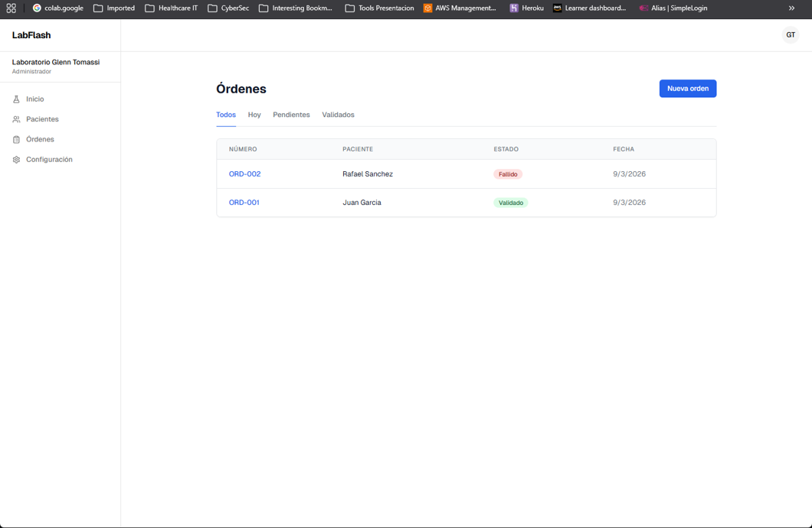
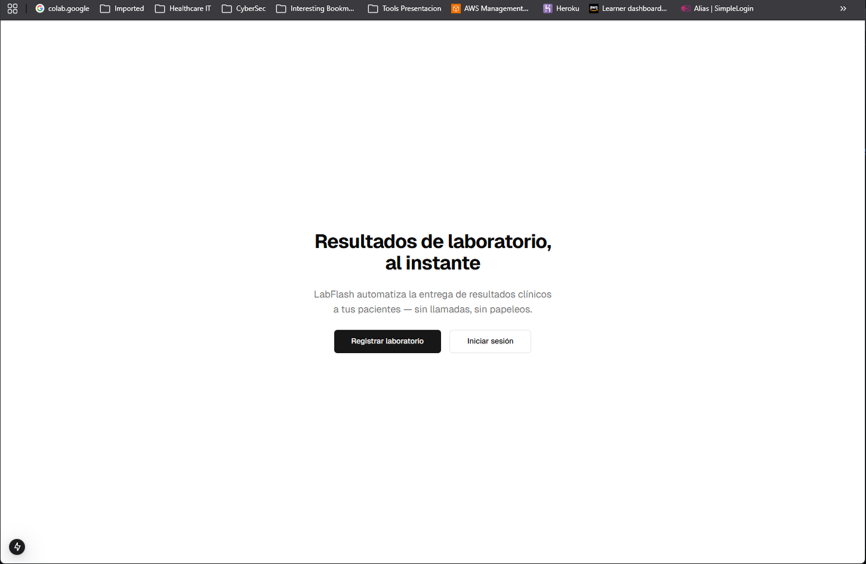
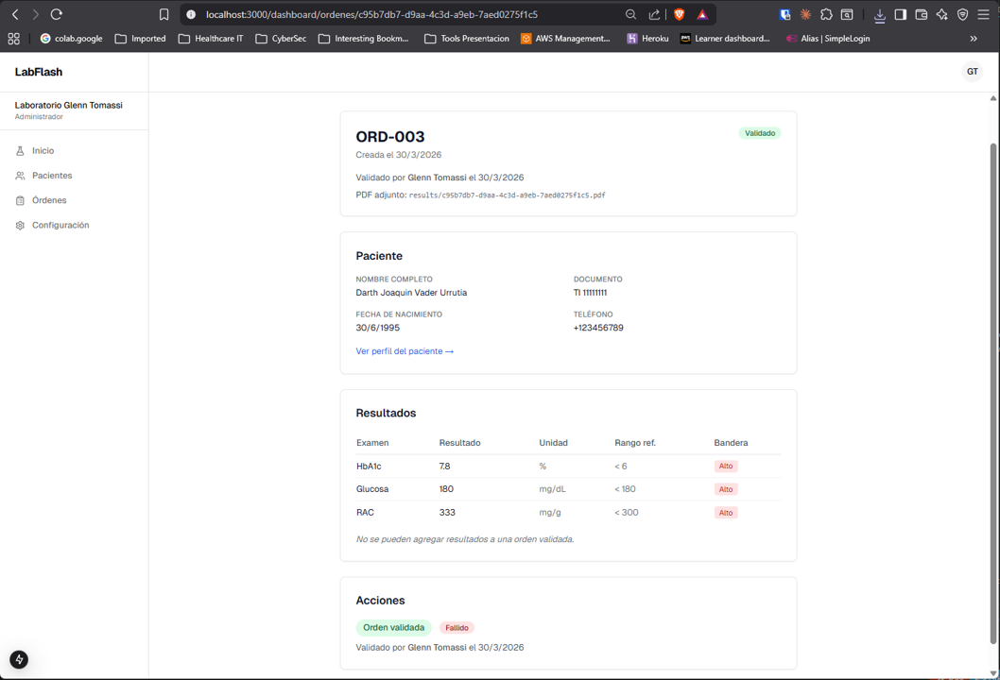
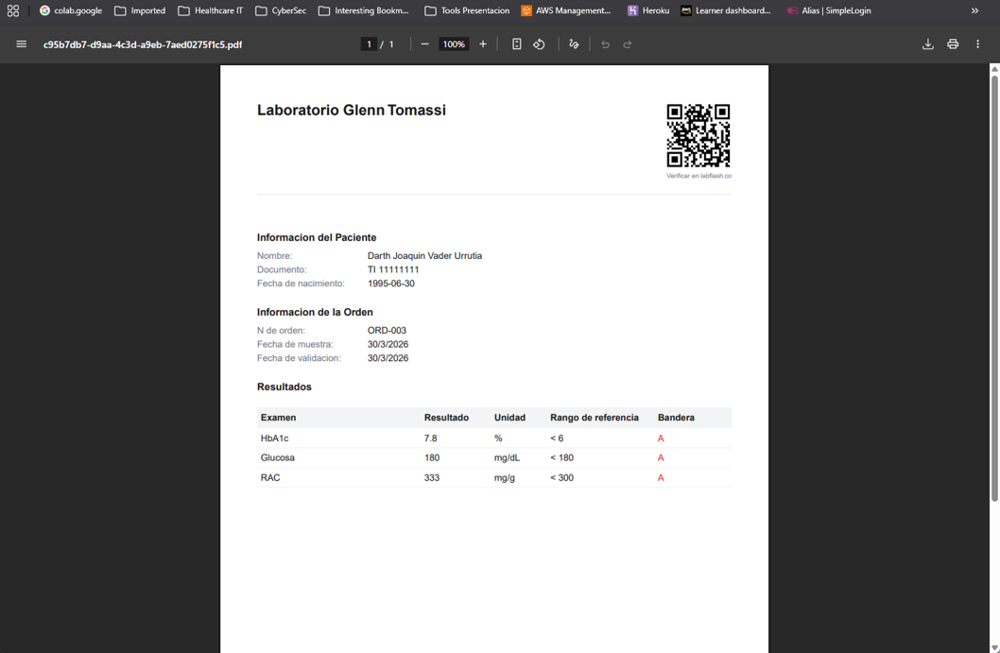
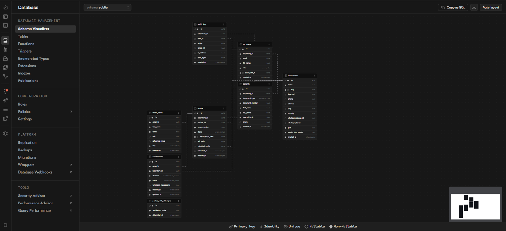

# LabFlash

Lightweight SaaS middleware that delivers clinical lab results to patients via WhatsApp and a secure web portal. It sits between the lab's existing system and the patient's phone — it is **not** a LIS: no sample management, no billing.

When a lab technician marks results as **validated**, the patient instantly gets a WhatsApp message with a secure link to their PDF results, authenticated by document number + date of birth. Target market: small/medium clinical labs in Colombia and Venezuela (50–500 samples/day).



## How it works

1. Lab staff register their laboratory and log in (Supabase Auth, multi-tenant via RLS).
2. They create patients and orders, then enter results manually or attach a PDF.
3. **Validate & Send**: the order is marked validated, a branded PDF with a QR code is generated and uploaded to Supabase Storage, and a WhatsApp template message (`resultado_listo`) is sent via the Meta Cloud API.
4. The patient opens `labflash.co/r/<code>`, authenticates with document type/number + date of birth (no passwords, 5 attempts/hour rate limit), and views/downloads the PDF via a 1-hour signed URL.
5. Anyone can scan the QR at `/verify/<code>` to confirm the result's authenticity.
6. Delivery receipts (sent → delivered → read) arrive via webhook and update the dashboard in real time (Supabase Realtime).

## Stack

- **Next.js 15** (App Router, Server Actions, React 19)
- **Supabase** — Auth, Postgres, Storage, Realtime
- **Drizzle ORM** (+ SQL migrations in `drizzle/migrations/`)
- **@react-pdf/renderer** for PDF generation, **qrcode** for QR codes
- **Meta WhatsApp Cloud API** for notifications
- **Tailwind CSS** + a few shadcn/ui components

## Development

### With Docker (recommended)

```bash
# create .env.local first — see Environment variables below
docker compose up
```

App runs at http://localhost:3000 with hot reload. `node_modules` lives in a named volume inside the container.

### Without Docker

```bash
npm install
npm run dev
```

### Environment variables (`.env.local`)

| Variable | Purpose |
|---|---|
| `NEXT_PUBLIC_SUPABASE_URL` | Supabase project URL |
| `NEXT_PUBLIC_SUPABASE_ANON_KEY` | Supabase anon key (client) |
| `SUPABASE_SERVICE_ROLE_KEY` | Server-only; storage uploads, rate limiting |
| `DATABASE_URL` | Postgres pooler connection (Transaction mode) |
| `DATABASE_URL_DIRECT` | Direct Postgres connection (migrations) |
| `WHATSAPP_PHONE_NUMBER_ID` | Meta Cloud API sender phone ID |
| `WHATSAPP_ACCESS_TOKEN` | Meta Cloud API access token |
| `WHATSAPP_APP_SECRET` | HMAC validation of incoming webhooks |
| `WHATSAPP_VERIFY_TOKEN` | Webhook verification handshake |

### Scripts

```bash
npm run dev     # dev server (turbopack)
npm run build   # production build
npm test        # jest test suite (tests/)
npm run lint    # eslint
```

Database migrations are plain SQL in `drizzle/migrations/` (run in the Supabase SQL editor); RLS policies live in `supabase/migrations/`.

## Project structure

```
src/
  app/
    (auth)/            # login, register
    dashboard/         # orders, patients (staff-only)
    r/[code]/          # patient portal (ID + DOB auth)
    verify/[code]/     # public QR verification page
    api/webhooks/whatsapp/  # Meta delivery-status webhook (HMAC-verified)
  components/          # UI components
  lib/
    db/                # Drizzle schema + client
    pdf/               # PDF + QR generation
    portal/            # portal auth, rate limiting
    whatsapp/          # Cloud API template sender
    supabase/          # client/server/admin clients
tests/                 # jest tests (webhook, portal auth, rate limit, pdf, ...)
```

## Screenshots

| | |
|---|---|
|  |  |
|  |  |
